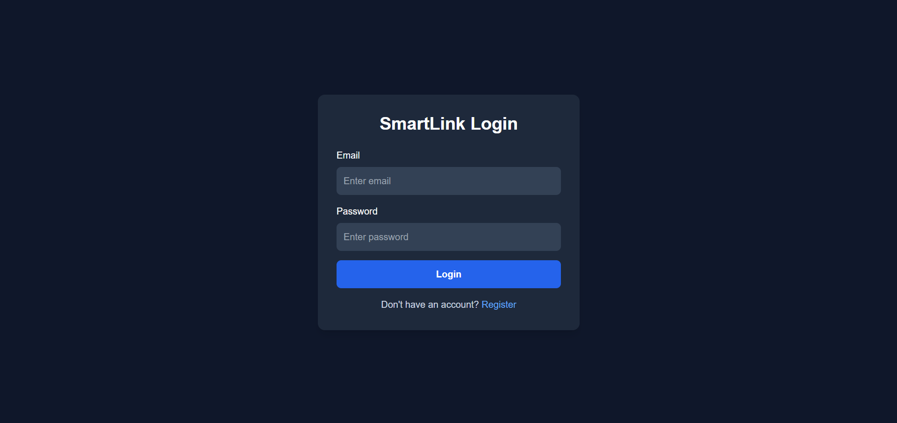
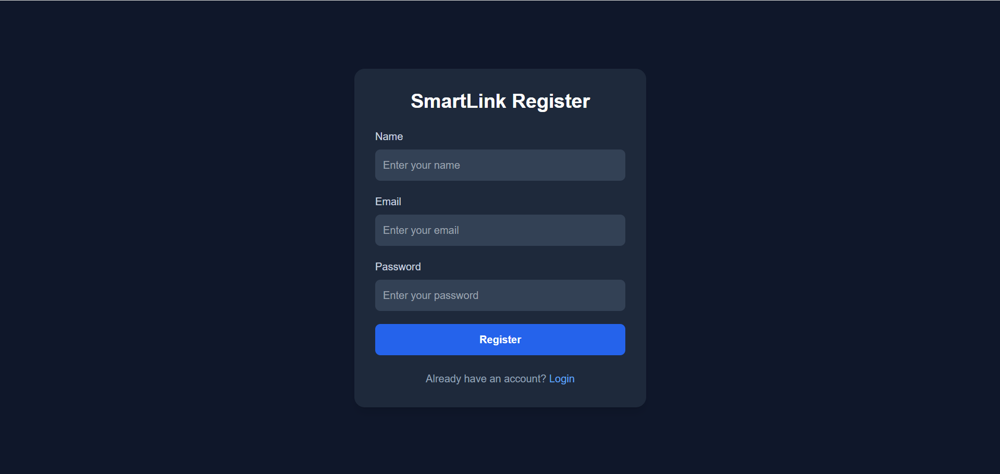
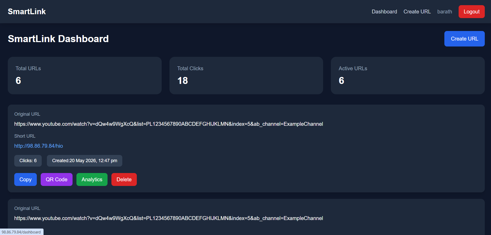
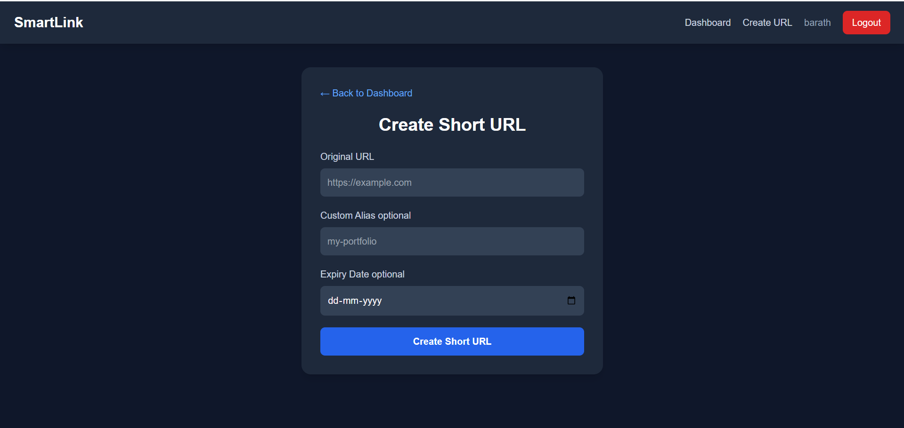
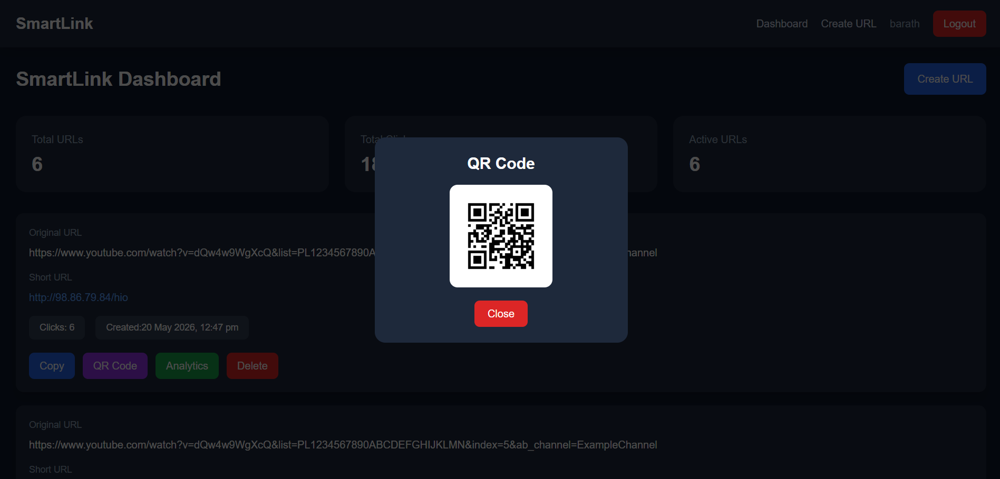
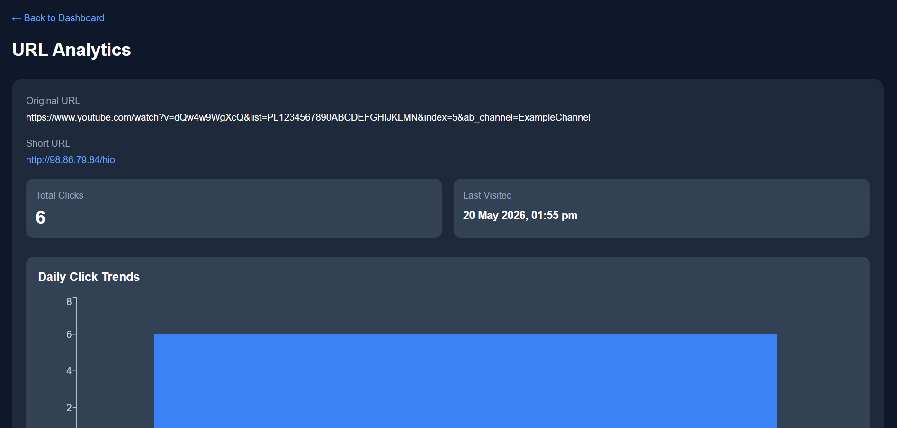
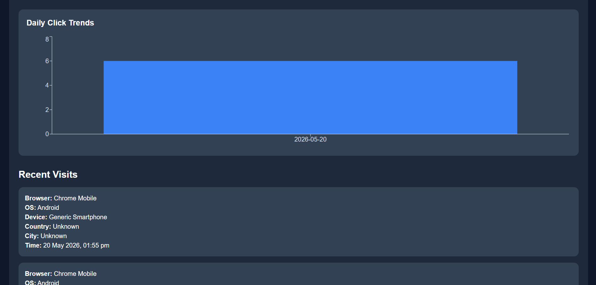
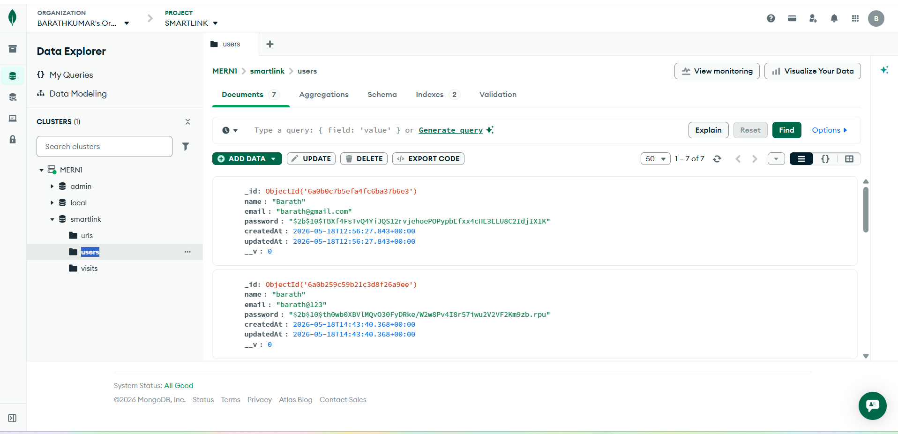
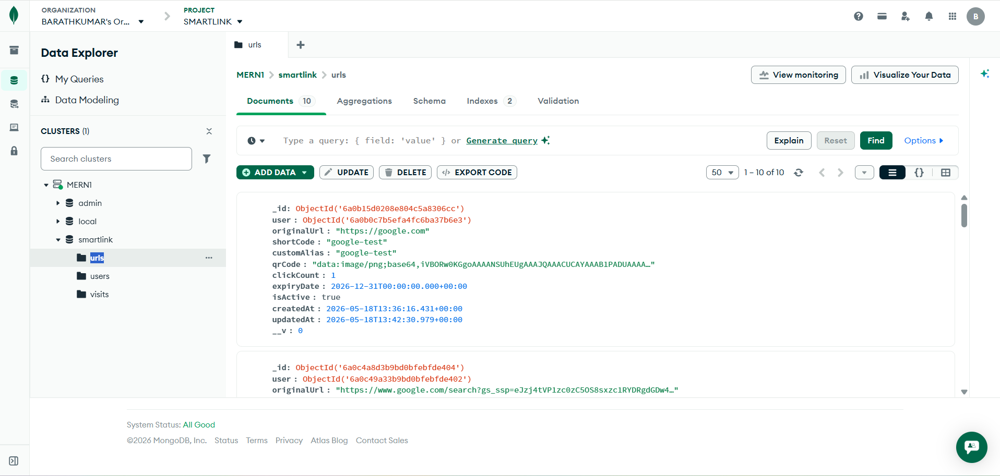
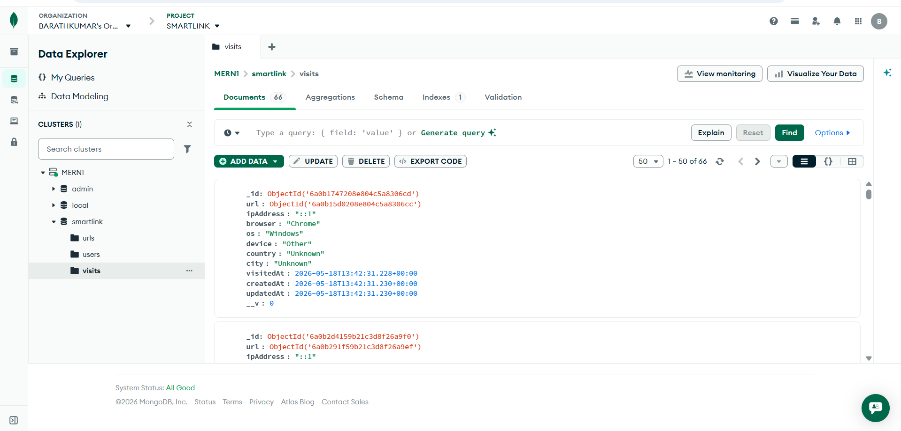

# SmartLink - URL Shortener with Analytics
Barathkumar R - 23CS032

SmartLink is a full-stack MERN URL shortener application where users can create short URLs, manage links, generate QR codes, set expiry dates, and track analytics such as clicks, browser, OS, device, country, city, and recent visit history.

## Features

- User signup and login
- JWT authentication
- Protected dashboard
- Create short URL
- Custom alias
- QR code generation
- Expiry date for links
- Redirect short URL to original URL
- Click count tracking
- Recent visit history
- Browser, OS, and device analytics
- Country and city analytics
- Daily click chart
- Delete shortened URL
- Responsive UI
- Loading, success, and error states

## Tech Stack

### Frontend
- React
- Vite
- Tailwind CSS
- Axios
- React Router DOM
- React Hot Toast
- Recharts

### Backend
- Node.js
- Express.js
- MongoDB
- Mongoose
- JWT
- bcryptjs
- nanoid
- qrcode
- geoip-lite
- ua-parser-js

## Project Structure

```txt
smart-link/
├── backend/
│   ├── src/
│   │   ├── config/
│   │   ├── controllers/
│   │   ├── middleware/
│   │   ├── models/
│   │   ├── routes/
│   │   ├── utils/
│   │   ├── app.js
│   │   └── server.js
│   └── package.json
│
├── frontend/
│   ├── src/
│   │   ├── api/
│   │   ├── components/
│   │   ├── hooks/
│   │   ├── layouts/
│   │   ├── pages/
│   │   ├── routes/
│   │   └── utils/
│   └── package.json

## Architecture

React Frontend
     ↓
Axios API Calls
     ↓
Express Backend
     ↓
JWT Middleware
     ↓
Controllers
     ↓
MongoDB Database


## URL Redirect Flow

User opens short URL
        ↓
Backend finds shortCode
        ↓
Checks expiry date
        ↓
Stores analytics visit
        ↓
Increases click count
        ↓
Redirects to original URL

## Database Collections
# User

{
  name,
  email,
  password,
  createdAt
}

# Url

{
  user,
  originalUrl,
  shortCode,
  customAlias,
  qrCode,
  clickCount,
  expiryDate,
  isActive,
  createdAt
}

# Visit

{
  url,
  ipAddress,
  browser,
  os,
  device,
  country,
  city,
  visitedAt
}

## Assumptions

->Country and city may show Unknown while testing on localhost.
->Correct location analytics works better after deployment.
->Render free hosting may delay QR redirect because of cold start.
->Analytics is stored only when the short URL is opened.
->Expired URLs will not redirect to the original URL.


### AI Planning Document

## AI tools were used to plan and generate clean modular code. The application was planned  in the following steps:

Understand problem statement
Plan features
Design database models
Design backend REST APIs
Create authentication flow
Create URL shortening flow
Add analytics tracking
Build React frontend pages
Add reusable components
Add deployment-ready environment variables
Improve UI and validation


### Sample Outputs

## Login Page



## Register Page



## Dashboard



## Create Url

/

## Create QRcode

/

## Analytics1



## Analytics2



## MongoDB Collections





## Backend


## Demo Video

[Watch Full Project Demo](https://drive.google.com/drive/folders/1tOPm_luRzVtB2Tdwpm7mzQsujFXhqB5A)

Video Link: https://drive.google.com/drive/folders/1tOPm_luRzVtB2Tdwpm7mzQsujFXhqB5A


## Deployment
# AWS EC2

Frontend: http://98.86.79.84
Backend: http://98.86.79.84:5000


This project is a part of a hackathon run by https://katomaran.com